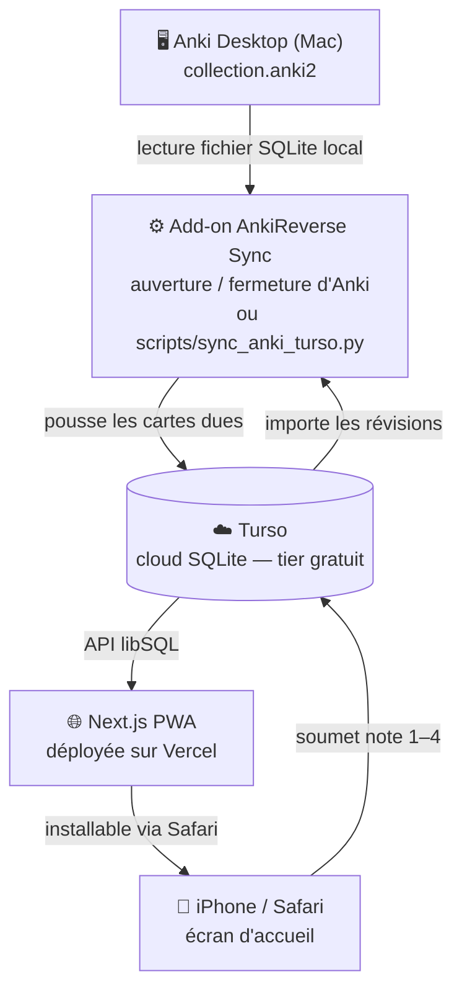
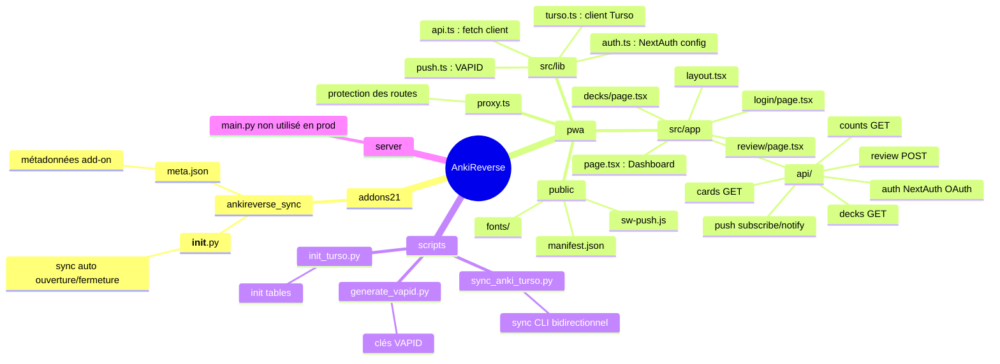
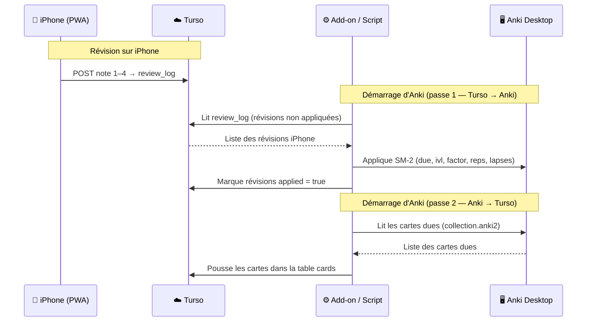

# AnkiReverse

PWA pour réviser ses fiches Anki sur iPhone et Mac, avec notifications push.
Conçu pour remplacer AnkiMobile sans payer 30€ — fonctionne dans Safari comme une app native.

---

## Architecture



### Comment ça marche ?

1. **Anki Desktop** stocke toutes les cartes dans un fichier SQLite local (`collection.anki2`)
2. **L'add-on Anki** (ou le script Python) lit ce fichier et pousse les cartes dues vers **Turso** (base cloud)
3. La **PWA Next.js** déployée sur Vercel interroge Turso via API pour afficher les cartes
4. Quand on révise sur iPhone, la note (1-4) est enregistrée dans Turso
5. Au prochain démarrage d'Anki Desktop, l'add-on récupère les révisions iPhone et les applique dans Anki (algorithme SM-2)

---

## Fonctionnalités

- Révision des cartes dues avec algorithme SM-2 (identique à Anki)
- Filtrage par deck (sélection dans "Mes decks")
- Notifications push (rappel quotidien à 9h)
- Auth GitHub OAuth (accès personnel uniquement)
- Design sombre style macOS, police Neris, animations fluides
- Installable sur iPhone via Safari → Partager → Sur l'écran d'accueil

---

## Stack

| Composant | Technologie |
|-----------|-------------|
| Frontend | Next.js 16 App Router + Tailwind CSS v4 |
| Base de données | Turso (libSQL cloud, tier gratuit) |
| Auth | NextAuth.js + GitHub OAuth |
| Push | Web Push API + VAPID |
| Déploiement | Vercel (tier gratuit) |
| Sync Mac | Python + libsql_experimental |

---

## Structure du projet



---

## Installation complète

### Prérequis

- Anki Desktop installé sur Mac avec les cartes
- Compte GitHub (pour l'OAuth)
- Compte Turso (gratuit) : https://turso.tech
- Compte Vercel (gratuit) : https://vercel.com

---

### Étape 1 — Turso (base de données cloud)

```bash
# Installer le CLI Turso
brew install tursodatabase/tap/turso
turso auth login

# Créer la base
turso db create ankireverse
turso db show ankireverse           # copie l'URL (libsql://...)
turso db tokens create ankireverse  # copie le token

# Initialiser les tables
pip install libsql-experimental
TURSO_URL="libsql://..." TURSO_TOKEN="..." python scripts/init_turso.py
```

---

### Étape 2 — GitHub OAuth

1. Aller sur https://github.com/settings/developers → **New OAuth App**
2. **Homepage URL** : `https://ton-app.vercel.app`
3. **Authorization callback URL** : `https://ton-app.vercel.app/api/auth/callback/github`
4. Copier le **Client ID** et génèrer un **Client Secret**

---

### Étape 3 — Variables d'environnement

Crée `pwa/.env.local` :

```env
# Turso
TURSO_URL=libsql://ankireverse-xxx.turso.io
TURSO_TOKEN=eyJ...

# GitHub OAuth
GITHUB_ID=ton_client_id
GITHUB_SECRET=ton_client_secret

# NextAuth
NEXTAUTH_SECRET=une_chaine_aleatoire_longue   # openssl rand -base64 32
NEXTAUTH_URL=https://ton-app.vercel.app

# Accès restreint à toi uniquement
ALLOWED_EMAIL=ton@email.com

# VAPID (notifications push)
# Générer avec : python scripts/generate_vapid.py
NEXT_PUBLIC_VAPID_KEY=BxxxxPublicKey
VAPID_PRIVATE_KEY=xxxxPrivateKey
VAPID_EMAIL=mailto:ton@email.com
```

---

### Étape 4 — Déploiement sur Vercel

1. Push le code sur GitHub
2. Connecte le repo sur https://vercel.com → New Project
3. **Root Directory** : `pwa/`
4. Ajoute toutes les variables d'env dans Vercel → Settings → Environment Variables
5. Deploy

---

### Étape 5 — Add-on Anki Desktop (sync automatique)

L'add-on s'installe une seule fois et gère le sync automatiquement à chaque ouverture/fermeture d'Anki. Plus besoin de lancer le script manuellement.

**5a. Installer la dépendance Python**

```bash
pip install libsql-experimental
```

**5b. Créer le fichier `.env` à la racine du projet**

```bash
cp .env.example .env
```

Remplir `TURSO_URL` et `TURSO_TOKEN` dans ce fichier `.env`.

**5c. Copier le dossier de l'add-on dans Anki**

```bash
cp -r addons21/ankireverse_sync \
  ~/Library/Application\ Support/Anki2/addons21/
```

> Le dossier `addons21/ankireverse_sync/` se trouve à la racine du repo.

**5d. Redémarrer Anki Desktop**

C'est tout. Dès que l'on ouvre Anki, le sync se lance en arrière-plan.
On peut aussi le déclencher manuellement via **Outils → AnkiReverse — Sync maintenant**.

**Ce que fait l'add-on :**
- **À l'ouverture** d'Anki → sync silencieux (importe les révisions iPhone, exporte les cartes du jour)
- **À la fermeture** d'Anki → sync final pour ne rien perdre
- **Menu Outils** → sync manuel avec notification du résultat

**Si on préfère le script en ligne de commande (sans add-on) :**
```bash
python scripts/sync_anki_turso.py
```

---

### Étape 6 — Installer la PWA sur iPhone

1. Ouvrir l'URL Vercel dans **Safari** (pas Chrome)
2. Se connecter avec son compte GitHub
3. Appuyer sur le bouton **Partager** (carré avec flèche) → **Sur l'écran d'accueil**
4. L'app s'installe comme une application native avec l'icône cerveau

---

## Sync bidirectionnel — détail technique

Le script `sync_anki_turso.py` fonctionne en deux passes :

1. **Turso → Anki Desktop** : lit la table `review_log` (révisions faites sur iPhone), applique les résultats dans le SQLite local d'Anki avec SM-2 (mise à jour de `due`, `ivl`, `factor`, `reps`, `lapses`), puis marque les révisions comme appliquées
2. **Anki Desktop → Turso** : lit les cartes dues dans le SQLite local et les pousse dans la table `cards` de Turso



---

## Notifications push

Les notifications nécessitent :
- D'avoir cliqué "Activer" dans l'app (Safari iOS 16.4+ requis)
- Les clés VAPID configurées dans les variables d'environnement Vercel
- Le cron Vercel configuré sur `/api/push/notify` pour 9h chaque matin
